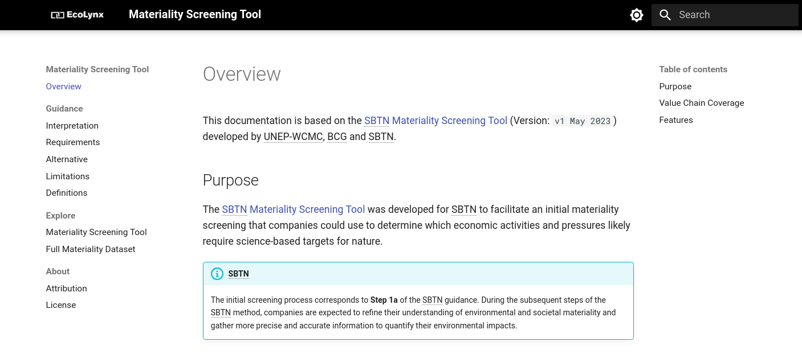

<p align="center">
  <a href="https://ecolynx.github.io/sbtn-materiality-screening-tool/">
    
  </a>
</p>

<p align="center">
  <strong>
    A materiality screening tool to determine which economic activities and pressures 
    likely require science-based targets for nature.
  </strong>
</p>

<p align="center">
  <a href="https://ecolynx.github.io/sbtn-materiality-screening-tool/">
    
  </a>
</p>

<p align="center">
  <em>
    Check out the site – 
    <a
      href="https://ecolynx.github.io/sbtn-materiality-screening-tool/"
    >ecolynx.github.io/sbtn-materiality-screening-tool</a>.
  </em>
</p>

<h2></h2>
<p>&nbsp;</p>

## Quick start

To serve the documentation locally, install the dependencies and run `mkdocs`:

``` sh
pip install -r requirements.txt
mkdocs serve
```

For detailed installation instructions, configuration options, and a demo, visit
[squidfunk.github.io/mkdocs-material][Material for MkDocs]

  [Material for MkDocs]: https://squidfunk.github.io/mkdocs-material/

## Attribution

This documentation is based on the [SBTN Materiality Screening Tool](https://sciencebasedtargetsnetwork.org/wp-content/uploads/2023/05/SBTN-Materiality-Screening-Tool-v1.xlsx) developed by UNEP-WCMC, BCG and SBTN.

## Citation

The user must ensure that the following citation is always clearly reproduced in any publication or analysis involving the original tool in any derived form or format:

```
SBTN Materiality Screening Tool (Version 1).  
Science Based Targets Network (SBTN). 2023.  
Available at: https://sciencebasedtargetsnetwork.org/wp-content/uploads/2023/05/SBTN-Materiality-Screening-Tool-v1.xlsx
```
