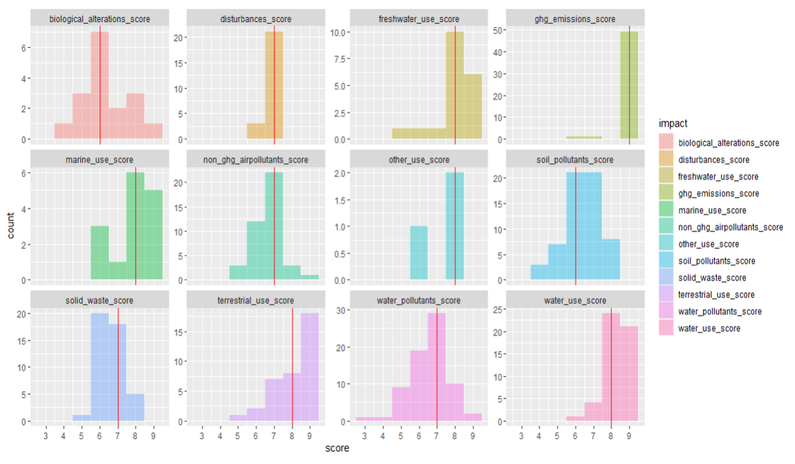

# Interpretation

The [materiality tool](direct-operations.md) provides users with ratings of materiality for different economic activities. These activities are listed as [`ISIC group`](definitions.md#isic-group) and UNEP-WCMC [`production process`](definitions.md#production-process) pairs ([`group-process`](definitions.md#group-process) pair).

Each [`group-process`](definitions.md#group-process) has been evaluated for material contributions toward twelve different **pressure categories**. A numerical indexed **pressure score** is attributed to each [`group-process`](definitions.md#group-process) and **pressure category** (`activity-pressure` pair). Additional values have also been added to indicate whether or not the score is significant, using a categorical **materiality rating**, based on a **materiality threshold**. This threshold is based on the full distribution of numerical scores for all of the base economic activities present in the underlying dataset.

The [materiality tool](direct-operations.md) currently facilitates the analysis of environmental impacts at the [`production process`](definitions.md#production-process) level. A **materiality rating** is associated with each [`production process`](definitions.md#production-process) indicating whether or not the activity is considered material in a given **pressure category**.

## Pressure Categories

The **pressure categories** included in the tool are based on the [ENCORE framework](https://encore.naturalcapital.finance/). They are grouped into five nature-related issue areas. These five issue areas are based on the drivers of nature loss defined by IPBES in the 2019 Global Assessment: 

 - Land/Water/Sea Use Change
 - Resource exploitation
 - Climate Change
 - Pollution
 - Invasive alien species & other

Of the **pressure categories** included in the [materiality tool](direct-operations.md), only five are considered to be in scope for this version of the SBTN methods (Version: `v1 May 2023`).

!!! note "SBTN"
    The **terrestrial ecosystem use** category is referred to as **land use and land use change** in the SBTN framework.

!!! info "Scope"
    To set targets using the SBTN methods, companies will be required to complete, at a minimum, a materiality screening of the five **pressure categories** that are in scope. Screening of the additional seven categories within the current SBTN full pressure scope, as well as any other categories is encouraged but not required.

## Pressure Scores

There are six possible **pressure scores**, ranging from 3 to 9. The scores are based on an evaluation by the ENCORE team of the activities' contributions to the different **pressure categories** according to three components of materiality: 

- Magnitude
- Frequency
- Timeframe (latency)

Each component was evaluated along a scale of 1 to 3, with 1 being the lowest and 3 being the highest. When there is not enough information to attribute a score, the tool will read **ND** (No Data).

!!! note "No Data"
    The **ND** attribute does not mean that it is not likely there is an impact. This value reflects the findings of the initial research effort that underpins this dataset.

!!! info "Direct Operations"
    Activity scores are considered to be those representing a company's direct operations only. Currently, upstream scores can be retrieved by users based on the known connections between activities in a company's direct operations and those of their upstream suppliers.

## Materiality Thresholds

For each of the **pressure categories** included in the tool, a **materiality threshold** was derived. This threshold is the median of the distribution of **pressure scores** for a given **pressure category**.

<figure markdown>
  { width="800" }
  <figcaption>Materiality Thresholds Distributions</figcaption>
</figure>

## Materiality Ratings

When activities are shown to have a **pressure score** greater than or equal to the **materiality threshold**, they are said to be material and require further assessment in the SBTN **Step 1** method. Activities that do not surpass that **materiality threshold** in any **pressure category** are not required for further assessment.

!!! info inline end "Materiality Ratings"
    - **Material**: 1
    - **Not Material**: 0 

Ratings are expressed as a binary score which indicates the need for users to continue to assess this activity in the SBTN methodology (i.e. **Step 1b**) for a given pressure.

In this version of the tool, the materiality of each activity's contribution towards each pressure is evaluated in relation to all other activities' contributions towards that **pressure category**. 

!!! example "Example"
    The materiality of the contributions of the activity `Construction` towards **terrestrial ecosystem use** are evaluated in relation to all other activities, including `Crop growing` as well as `Telecommunications`. 
